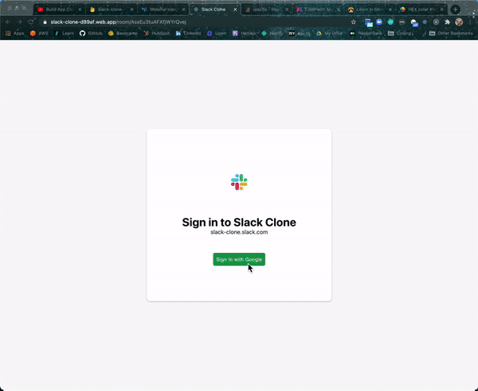

[Demo](https://www.loom.com/share/c92b2007b73543caaf7858046d3092cf)

[Deployed App](https://slack-clone-d89af.web.app)

## Features
* Uses React to render chat features where users can post messages in channels and add new channels
* Allows for users to sign up using Google authentication

## Tech Used
### Frontend
* React.js
* Material UI
* React Router

### Backend
* Firebase